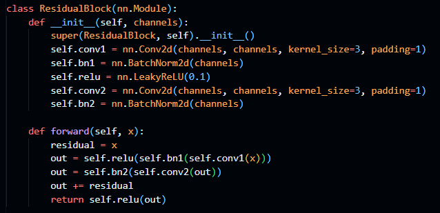
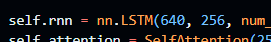
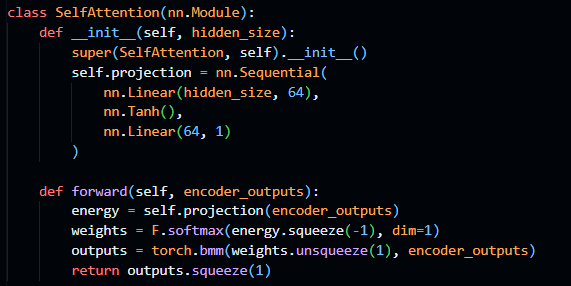
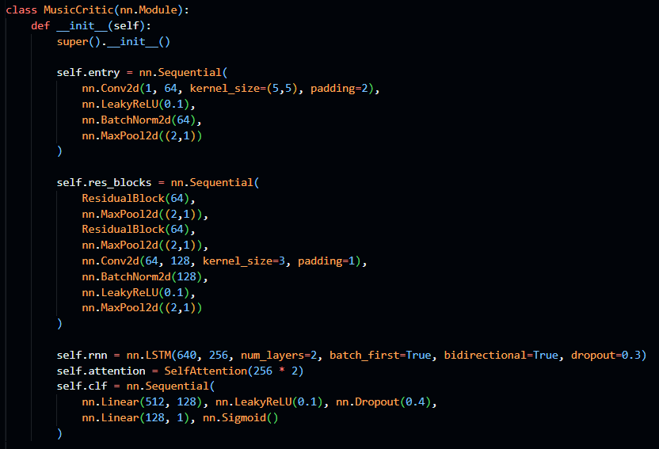
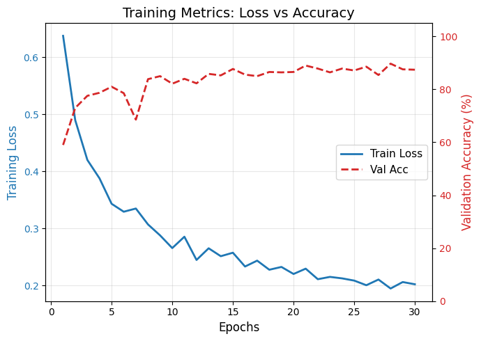
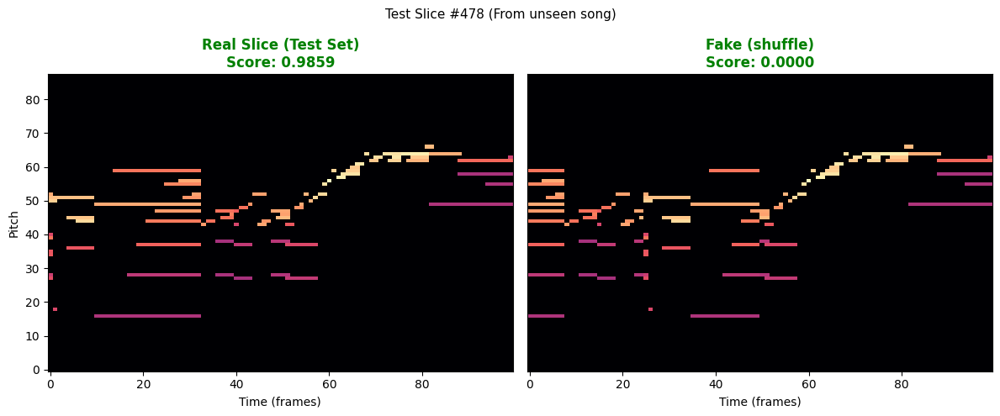
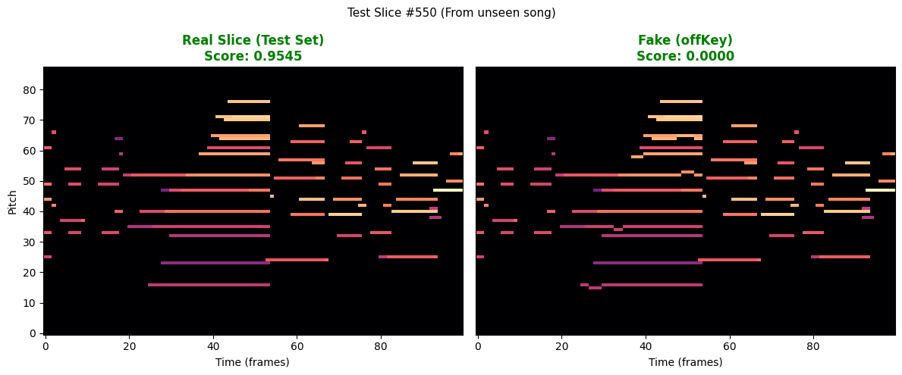
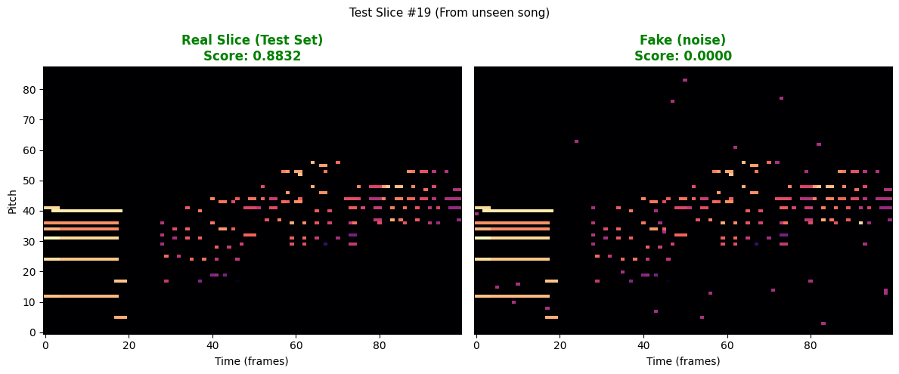
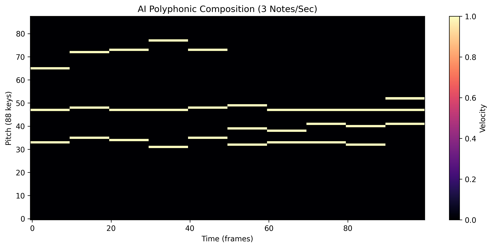

# ML Final Project Report

### 音樂評分模型
*作者：黃俊豪 112652039*

## 1. 問題描述

### 1.1 背景與動機
隨著生成式 AI（Generative AI）在圖像與自然語言處理領域的突破，音樂生成模型（如 MusicLM, MuseNet）也取得了顯著進展。然而，音樂生成領域面臨一個核心難題：如何客觀評估生成的音樂品質？

傳統的評估指標（如 Loss, Perplexity）僅能衡量模型預測下一個音符的機率準確度，無法反映音樂的審美品質或結構完整性。人類評估雖然準確，但成本高昂且無法擴展。我們需要一個能夠自動化判別音樂是否具備「人類創作邏輯」的代理模型。

### 1.2 任務定義
本專案旨在構建一個二元判別模型，其目標並非生成音樂，而是學習區分：

- 真實音樂：具備和聲學邏輯、旋律發展與曲式結構的人類作品
- 偽造音樂：經過算法破壞，喪失局部和諧性或全局連貫性的音樂片段

透過解決這個分類問題，模型被迫學習隱含的樂理規則與審美特徵，從而具備成為未來生成模型獎勵函數的潛力。

## 2. 理論對應

本模型的設計深受自監督學習 (Self-Supervised Learning) 與音樂資訊檢索 (MIR) 理論的啟發。

### 2.1 對比學習
我們採用自監督學習中的「代理任務 (Pretext Task)」，透過人工構造負樣本（Negative Sampling）來訓練模型，無需人工標註即可獲取大量訓練數據。

### 2.2 音樂的雙重屬性
音樂數據 (MIDI) 同時具備兩種特徵，我們的模型設計直接對應這兩種屬性：

- 垂直屬性：同一時間點上不同音高的組合（和弦）。這類似於圖像的紋理，適合用 CNN (卷積神經網絡) 提取特徵。
- 水平屬性：音符隨時間的演變（旋律、節奏）。這屬於序列數據，適合用 RNN (LSTM) 捕捉長期依賴。

## 3. 模型設計

### 3.1 數據前處理與表徵
- 數據集：MAESTRO v3.0.0 (Virtuoso Piano Performances)，包含約 1,200 首高質量的古典鋼琴 MIDI。
- 表徵形式：Piano Roll（鋼琴卷簾）。將 MIDI 轉換為二維矩陣 $X \in \mathbb{R}^{88 \times 100}$ ，其中 88 代表鋼琴鍵位，100 代表 10 秒的時間長度（採樣率 10Hz）。
- 全曲切片：為了平衡長短曲目並增加樣本多樣性，我們對每首樂曲進行全曲切片，並過濾掉純靜音片段。訓練時，每首歌隨機採樣固定數量的片段（如 10 個），確保數據平衡。
- 數據總量：為平衡樣本多樣性與訓練時間等因素，最終決定從數據集中隨機選出 700 首曲目，切片後會得到 7000 筆數據，每筆 10 秒鐘。

### 3.2 負樣本生成策略
- 打亂 ：將 10 秒的片段切分為 3~7 個小塊，隨機打亂順序。這迫使模型檢查小節之間的銜接是否流暢。
- 跑調 ：隨機選取幾個音符，將其音高上下平移 1 個半音。這會製造強烈的小二度不協和音，迫使模型學習和聲學規則。
- 雜音 ：隨機生成零星的雜音，讓模型學習判別出突兀的音符。

### 3.3 網絡架構
我們採用了 ResNet-CRNN-Attention 的混合架構：
1. 特徵提取層 (ResNet-CNN)：
   - 使用帶有殘差連接 (Residual Connection) 的卷積層。
   - 輸入： $(Batch, 1, 88, 100)$ 。
   - 作用：提取局部的和弦形狀與音程關係，殘差結構防止深層網絡的梯度消失。
   - 輸出維度：高度被壓縮至 5，通道數擴增至 256。\

1. 序列建模層 (Bi-LSTM)：
   - 將 CNN 輸出的特徵圖展平為時間序列向量。
   - 使用雙向 LSTM (Bi-Directional LSTM)，同時捕捉過去與未來的上下文資訊。
   - 作用：理解旋律的走向與解決（Resolution）。\

1. 注意力機制 (Self-Attention)：
   - 替代傳統的全局平均池化 (GAP)。
   - 作用：讓模型自動賦予權重。例如，當某個時間點出現「不協調」時，Attention 機制會聚焦於該時刻，判定其為負樣本的依據。\

1. 分類頭 (Classifier)：
   - 全連接層 + Sigmoid 激活函數，輸出 $P(Real|x)$ 。\

## 4. 結果 (Results)

### 4.1 訓練配置
- 數據分割：Train (80%) : Val (10%) : Test (10%)，嚴格依據「歌曲 ID」進行分割，防止數據洩露。
- 優化器：Adam (LR=0.001)。
- 損失函數：Binary Cross Entropy (BCE) Loss。
- 訓練輪數：30

### 4.2 訓練過程
在 30 輪的訓練中，誤差曲線呈現穩步下降的趨勢

### 4.3 定量評估
經過訓練後，模型在未見過的測試集 (Test Set) 上表現如下：

Total Test Accuracy : 92.71%

| Negative Type | Acc Rate | Avg Loss |
| --- | --- | --- |
| shuffle | 76.6% | 0.2362 |
| offKey | 90.3% | 0.0824 |
| noise | 94.9% | 0.0537 |

可見，模型可以有效的學習到音樂的結構，但較為不擅于處理打亂型 (shuffle) 的負樣本。

### 4.4 定性分析 (可視化盲測)
我們對測試集進行了可視化盲測：

- 正樣本識別：模型對結構嚴謹的巴哈、蕭邦作品給予接近 1.0 的高分。

- 負樣本攔截：
    - 對於 Shuffle 樣本，模型能敏銳地發現小節線處的突兀跳變，給予低分。
    - 對於 OffKey 樣本，即使只有幾個音符跑調，模型也能通過 Attention 機制捕捉到不協和點，成功判定為假。
    - 對於 Noise 樣本，模型可以很輕鬆的注意到突兀的雜音，並給出低分

## 5. 討論

### 5.1 模型學到了什麼？
通過實驗我們發現，簡單的模型（如純 CNN 或 GAP）容易陷入「捷徑學習」，僅通過計算音符密度來判斷真偽。引入 ResNet 與 Self-Attention 後，模型開始關注音樂的「語法錯誤」。這證明了模型確實學到了某種程度的樂理知識，而非僅僅是統計特徵。

### 5.2 局限性
- 風格偏差：目前模型僅在古典音樂數據集 (MAESTRO) 上訓練。若用於評估爵士樂（本身包含大量不協和音）或現代無調性音樂，可能會出現誤判。

- 二元限制：模型目前只能區分「真 vs 假」，無法區分「大師之作 vs 平庸之作」。它是一個合格的「糾錯員」，但還不是一個完美的「鑑賞家」。

- 資料取得：由於音樂數據獲取困難，我們的數據多樣性嚴重缺乏。這也導致我們的負樣本生成方式過於「直接」，所謂不好聽的音樂太明顯了，我們的模型無法再進一步，領悟真正的音樂審美。

### 5.3 未來展望
1. 細粒度評分：將二元分類擴展為回歸問題，引入更細緻的破壞程度（如 10% 跑調 vs 50% 跑調），讓模型輸出連續的分數。

2. 生成模型整合：將訓練好的 MuseCritic 作為強化學習 (RLHF) 的 Reward Model，引導 Diffusion 或 Transformer 生成模型創作出結構更嚴謹的音樂，這將是本專案最終的應用目標。

## 6. 後記

基於評分模型設計的簡單生成模型

### 想法：貪心算法
考慮一個1秒一個音符的簡化樂譜。對於每一秒，我們遍歷所有的88种可能，並選擇模型評分最高的音符，這樣我們就可以的生成一段簡單的 ai 音樂。

### 設計
- 如果只選評分最高的音，那模型大概率會一直選同一個音，所以為了更多的變化，我們會從評分最高的 3~5 個音中隨機選出其中一個。

- 每秒一個音較為單調，而且看不太出模型的功力，所以我們改成每秒3個音，策略是 「迭代叠加法」 (Iterative Layering)：
    - 第一层：就像之前一样，找出这一秒最适合的第 1 个音（主旋律）。
    - 第二层：保持第 1 个音不动，尝试叠加所有可能的第 2 个音，问模型哪个组合分数最高？
    - 第三层：保持前兩個音，尋找第 3 個音...

### 生成結果

